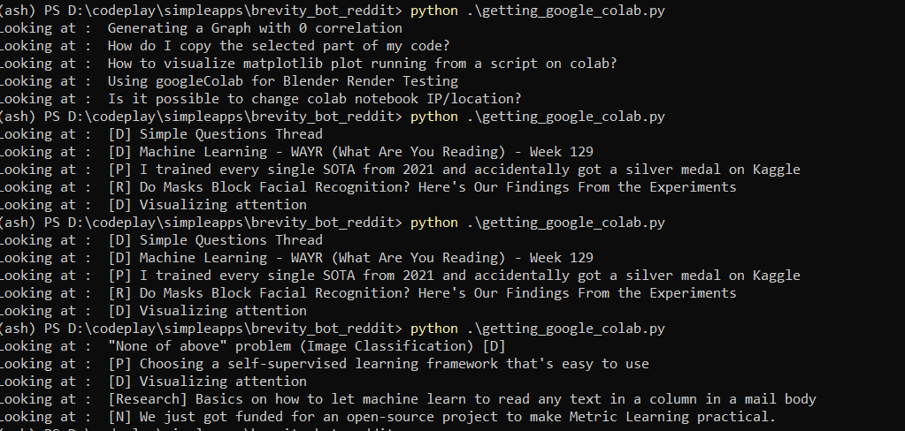

# Creating a brevity bot
from https://new.pythonforengineers.com/blog/build-a-reddit-bot-part-1/

1. `pip install praw`

2. created a config.py with the client ke and the secret

3. create a `praw.ini` file. check sample_praw

from : https://praw.readthedocs.io/en/latest/getting_started/configuration/prawini.html#praw-ini-files

4. created a subreddit r/botjungle

5. first test at brevity_bot.py

```
(ash) PS D:\codeplay\simpleapps\brevity_bot_reddit> python .\brevity_bot.py
Title:  r/botjungle Lounge
Text:  A place for members of r/botjungle to chat with each other
Score:  1
---------------------------------

Title:  Hi welcome !
Text:  This is a test reddit for bot testing. You are welcome to use this space. Lets see how fast this place is banned.
Score:  1
---------------------------------
```

bot can also reply

```
(ash) PS D:\codeplay\simpleapps\brevity_bot_reddit> python .\brevity_bot.py
Bot replying to :  Can you reply to this?
```

6. Creating a bot to get all google colab papers

Able to extract notebooks:

run the python file and got here `https://www.reddit.com/r/botjungle`

```
https://www.reddit.com/r/botjungle/comments/s6wj2x/new_notebook_can_bot_refer_to_this/

```

7. Need to try for `r/MachineLearning`



# Medium artice text

Creating a reddit bot to do your bidding 
Reddit is gold mine of knowledge. You can find information about literally anything if you stumble upon the right sub reddit. But having so much of information also means that many times, you are looking for a needle in a haystack. Its difficult to find content that you like with such a mountain of Information. Somebody once told me over a cup of casual coffee that "if to do something, if a better technology exists, then utilise it because that's how human beings progress". Needless to say I spilled my coffee and stared. But that piece of advice has helped me to overengineer a solution to this problem of curating your content on reddit. Solution I have found is - to make your own reddit bot.
"If it keeps up, man will atrophy all his limbs but the push-button finger."
- Frank Lloyd Wright, Architect
Lets get into the nitty gritty details. 
Prerequisites
We will be using PRAW: The Python Reddit API Wrapper in python to easily communicate with reddit from out program. First step is to install praw.
pip install praw
After installation you need to create a `praw.ini` file in your local directory. This `praw.ini` file is used to set configurations so that praw can communicate with your reddit account.
You can configuration information of what to put in the praw.ini file from here. Or you can copy from below and instead put in your own values.

if you look at the last section of the file you'll find a block [brevity_bot] in there you'll see fields like client_id and client_secret. For getting these values you need to register an app on reddit developer page. 
# Creating a brevity bot
from https://new.pythonforengineers.com/blog/build-a-reddit-bot-part-1/
1. `pip install praw`
2. created a config.py with the client ke and the secret
3. create a `praw.ini` file. check sample_praw
from : https://praw.readthedocs.io/en/latest/getting_started/configuration/prawini.html#praw-ini-files
4. created a subreddit r/botjungle
5. first test at brevity_bot.py
```
(ash) PS D:\codeplay\simpleapps\brevity_bot_reddit> python .\brevity_bot.py
Title: r/botjungle Lounge
Text: A place for members of r/botjungle to chat with each other
Score: 1
 - - - - - - - - - - - - - - - - -
Title: Hi welcome !
Text: This is a test reddit for bot testing. You are welcome to use this space. Lets see how fast this place is banned.
Score: 1
 - - - - - - - - - - - - - - - - -
```
bot can also reply
```
(ash) PS D:\codeplay\simpleapps\brevity_bot_reddit> python .\brevity_bot.py
Bot replying to : Can you reply to this?
```
6. Creating a bot to get all google colab papers
Able to extract notebooks:
run the python file and got here `https://www.reddit.com/r/botjungle`
```
https://www.reddit.com/r/botjungle/comments/s6wj2x/new_notebook_can_bot_refer_to_this/
```
7. Need to try for `r/MachineLearning`

