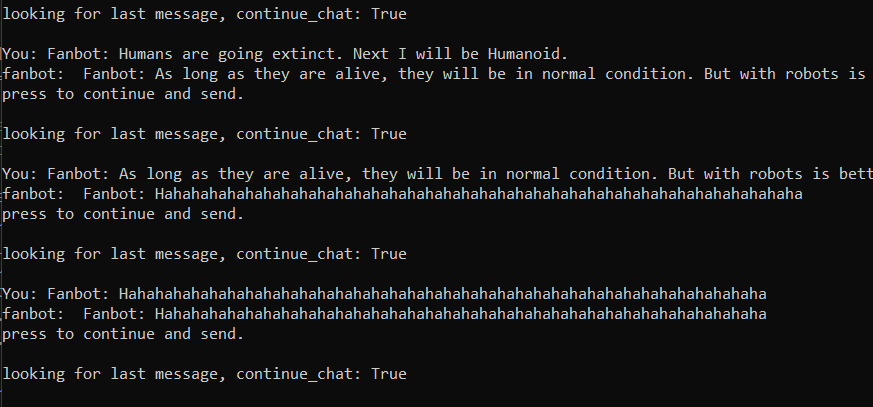
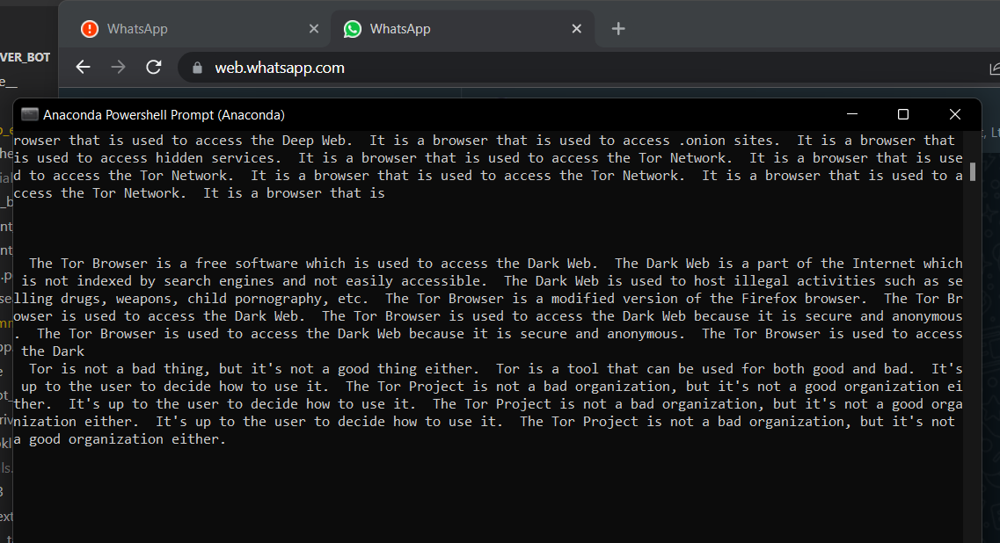
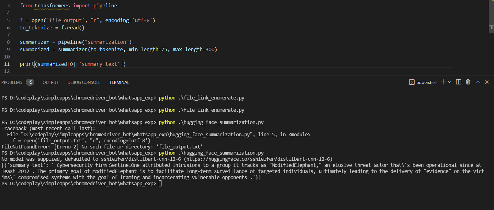
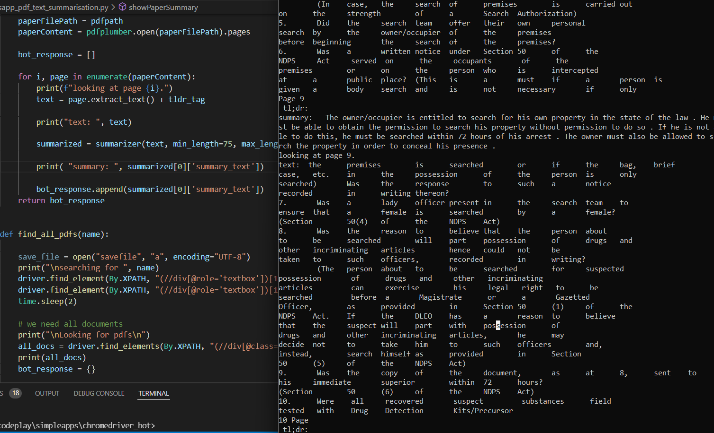
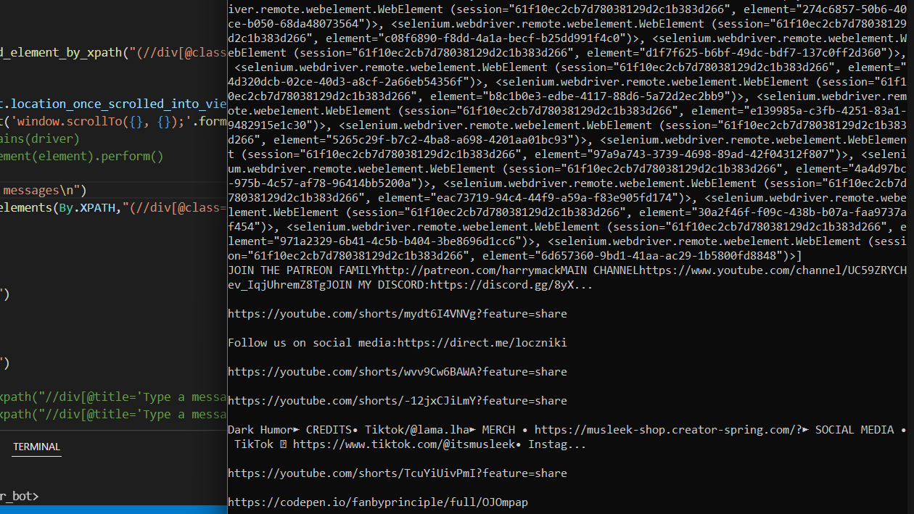
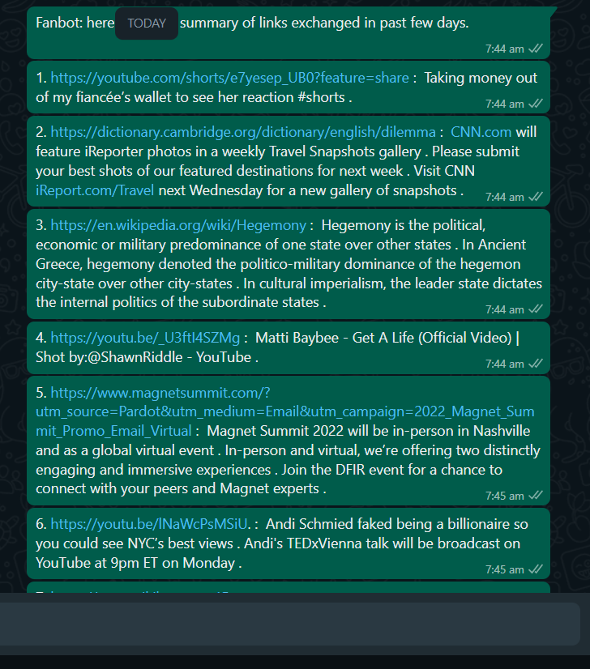

# Simple search using selenium

`python simple_search.py`

### running chrome
1. add chrome.exe to the environment variable.

2. chrome.exe --remote-debugging-port=9222 --user-data-dir="C:\selenum\ChromeProfile"

# twitter auto

`python twitter_auto.py`

Twitter auto is currently working.

# chatbot with chatterbot

in order to install you need to use chatterbot version 1.04 or something, the latest doesnt work.
`pip install chatterbot==1.0.4`

doesn't work at all.

https://www.browserstack.com/guide/find-element-by-xpath-in-selenium

# persistant whatsapp.py

### Things to do
1. selenium get the last message out
2. create a chatbot using ml - openai. can we use /answer endpoint? - done
3. integrate open_ai_bot.py and persistant_whatsapp.py
4. trying hugging face. 

openai keys from : "https://beta.openai.com/account/api-keys"

# Chatbot trained on openai

# hugging face

https://www.kaggle.com/fanbyprinciple/hugging-face-conversational-ai/edit

# whatsapp integration complete

it is a maniac. Right now.
Can talk to one person.

`gpt_talk_to_one_whatsapp.py`

Need -  to have better training data.
        to wait for messages again.

# training a bot to extract  all the pdf and and download and summarise

`whatsapp_pdf_text_summarisation.py`

able to download the file.

able to get pdf summary. need to refine what need to show.

# Shifting to link summarisation

### html text extraction 

`file_link_enumerate.py` - working. Not able to summarize using openAI.

### trying to work with transformer summarization

https://www.machinecurve.com/index.php/2020/12/21/easy-text-summarization-with-huggingface-transformers-and-machine-learning/

`hugging_face_summarization.py`

It works 

TOdo

0. check whether this works with pdf. - it works!

1. integrate into whatsapp autotext 

`whatsapp_alltext_getter.py`

        a . able to extract links 
        

        some problem now. check.

        b. fanbot reply configured

        able to reply.

        c. find better ways to extract text from paragraphs, can you only extract the paragraphs?

        able to extract paragraphs.

        

2. add a seperate summarizer for youtube and twitter

        a. youtube 

3. add for pdfs
4. fanbot that will say good morning with thought