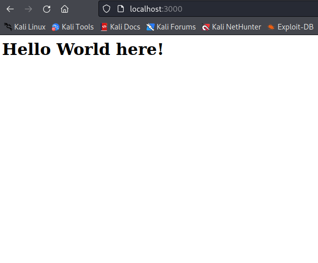

https://freshman.tech/web-development-with-go/

`tree`

Clone the starter files repo on GitHub - https://github.com/Freshman-tech/news-demo-starter-files

initial go build


templating


building with air-
```
 curl -sSfL https://raw.githubusercontent.com/cosmtrek/air/master/install.sh | sh -s 
 
 ./bin/air
```

loading static files


getting API keys from News API
https://newsapi.org/register
