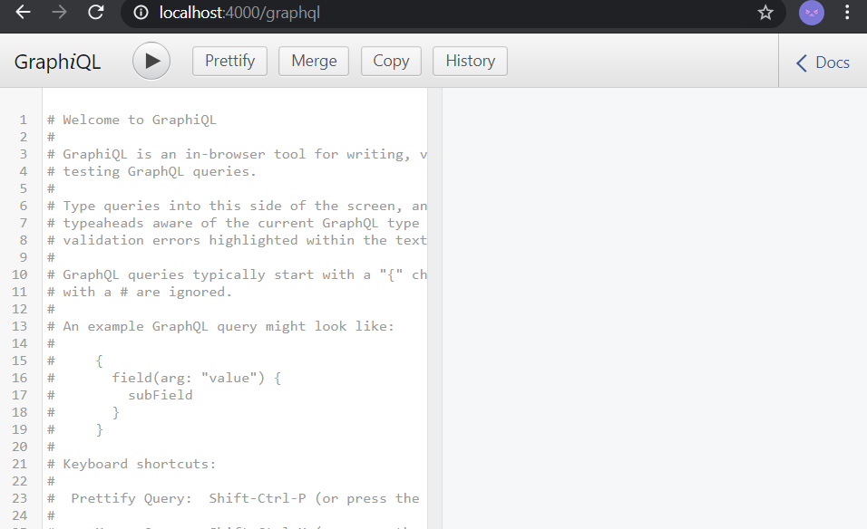

from : https://graphql.org/graphql-js/running-an-express-graphql-server/

gettting the console through an express app:

sending throug command line:

curl -X POST \
-H "Content-Type: application/json" \
-d '{"query": "{ hello }"}' \
http://localhost:4000/graphql
