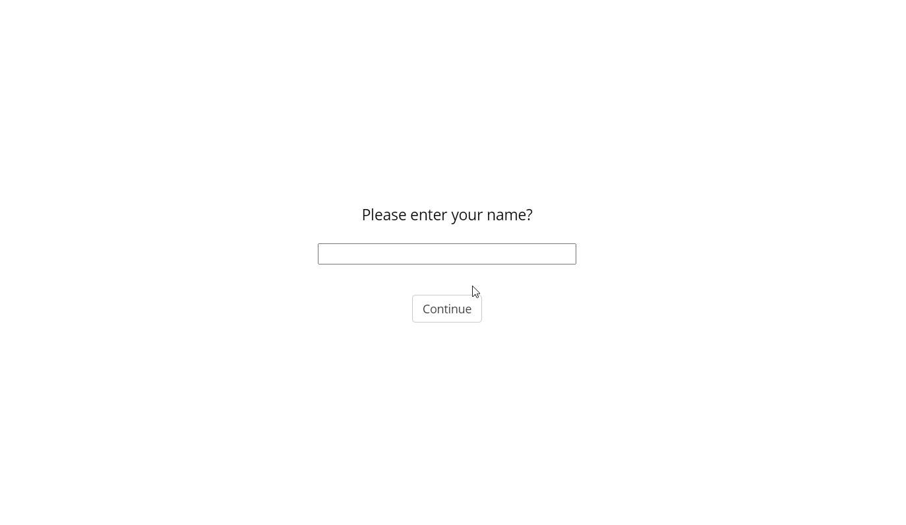

# deploying jspsych with jatos
# Creating Psychological surveys with JsPsych

Modifying the defualt Jspsych tutorial

Working with a survey type gonogo experiment

Trying to capture: youtube subtitles

captionString = ""

for (let i=0; i< document.getElementsByClassName('captions-text')[0].children.length; ++ i){
    captionString += " " +document.getElementsByClassName('captions-text')[0].children[i].innerText
}

// about video
document.getElementsByClassName('style-scope yt-formatted-string')[4].innerText 

for (let i=0; i< document.getElementsByClassName('captions-text')[0].children.length; ++ i){
    document.getElementsByClassName('style-scope yt-formatted-string')[4].innerText += " " + document.getElementsByClassName('captions-text')[0].children[i].innerText
}