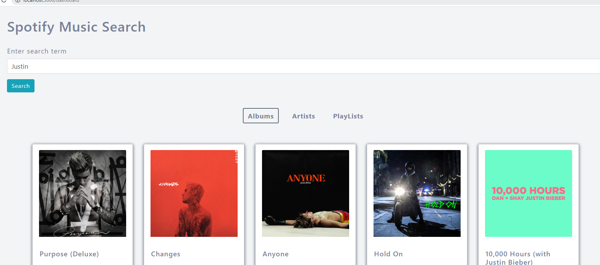

# Getting Started with Create React App

This project was bootstrapped with [Create React App](https://github.com/facebook/create-react-app).

## Available Scripts

In the project directory, you can run:

### `npm start`

Runs the app in the development mode.\
Open [http://localhost:3000](http://localhost:3000) to view it in the browser.

The page will reload if you make edits.\
You will also see any lint errors in the console.

https://levelup.gitconnected.com/how-to-create-a-spotify-music-search-app-in-react-1d71c8007e45

# Spotify plug

## Dependencies
npm install axios@0.19.2 bootstrap@4.5.2 lodash@4.17.19 prop-types@15.7.2 react-bootstrap@1.3.0 redux@4.0.5 react-redux@7.2.1 react-router-dom@5.2.0 redux-thunk@2.3.0

# things to search

props
connect

