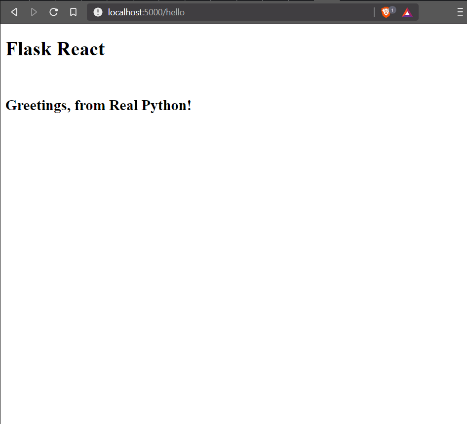

# creating a front end using react

This app is powered by Python 3 and the Flask framework in the back-end and React in the front. In addition, we will use gulp.js (task runner), bower (front-end package manager), and Browserify (JavaScript dependency bundler).

https://realpython.com/the-ultimate-flask-front-end/

It also tells about use of bower to install dependencies.

After installation of all components

https://realpython.com/the-ultimate-flask-front-end-part-2/
