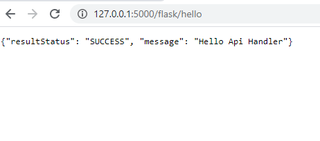
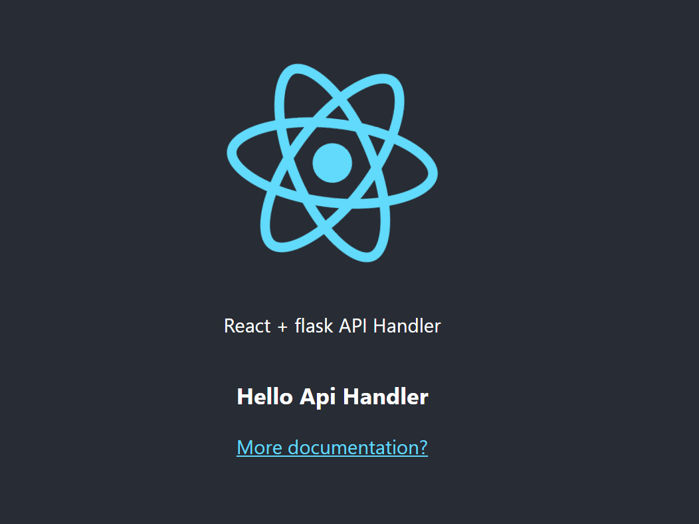

# React flask api handler

Taken from : https://towardsdatascience.com/build-deploy-a-react-flask-app-47a89a5d17d9

# Dependencies

`npm i react`
`pip install flask`

`pip install flask-restful`
`pip install flask_cors`
`npm install axios --save`

# to run flask server 

`flask run`

# to run react server

`cd frontend`
`npm start`

### Backend running succesfully

### Creating frontend

