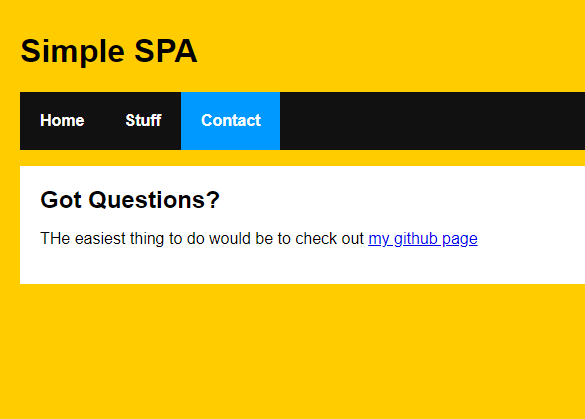

# React SPA

Creating a React based single page application.     

from kirupa: https://www.kirupa.com/react/creating_single_page_app_react_using_react_router.htm

## Available Scripts

In the project directory, you can run:

### `npm start`

Runs the app in the development mode.\
Open [http://localhost:3000](http://localhost:3000) to view it in the browser.

The page will reload if you make edits.\
You will also see any lint errors in the console.

# Dependencies

`npm i react-router-dom --save`

# Result

