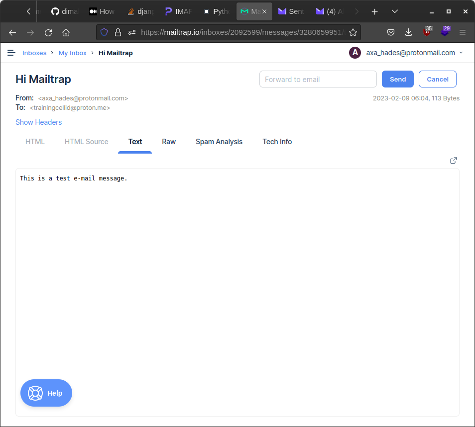

# smtp mailing

already implemented - https://github.com/dimaba/sendmail

but has google.com and outlook mail server

but need to try with proton mail

## using mailtrap.io

https://mailtrap.io/inboxes/2092599/messages

this sends mail to mailtrap directly

## using ssl

https://zetcode.com/python/smtplib/

can't use `websupport.sk` need creds
cant do with google as google has  removed support for less secure apps

