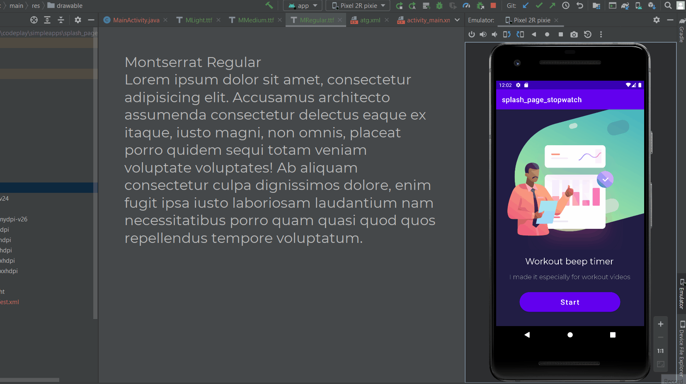
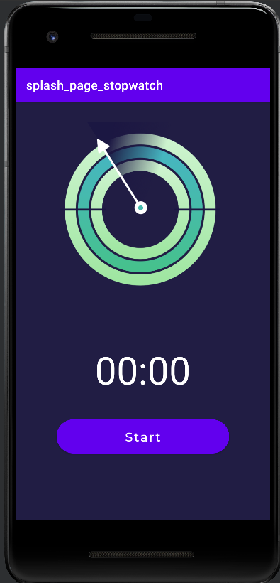

# Stop watch with splash page

https://www.youtube.com/watch?v=gqn7HqTnOPA

at 9.08 min

Completed splash page design animation

# Errors currently

1. https://stackoverflow.com/questions/30142056/error-unfortunately-you-cant-have-non-gradle-java-modules-and-android-gradle
delete .idea folder restart. and also wipe data from emulator and restart emulator.

2. https://stackoverflow.com/questions/23330816/error-package-android-support-v7-app-does-not-exist/57407028

Just needed to remove v7.compat line.
At 12.22.

Liquidate error first before continuing.

Tutorial finished

# Things to do

1. scale down the arrow of time
2. look at the background
3. Change the UI
4. add a stop and reset button
5. very important add beep